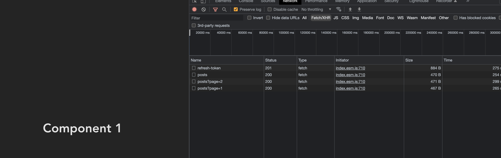

# Handle refresh token with `axios`, `umi-request` using interceptors, `apollo-client`, `token-management`, `brainless-token-manager`

### 1. Axios interceptors, Apollo-client
  - After all requests failed, we will call a request to take a new access token after that retry all requests which failed

### 2. `token-management` and `brainless-token-manager`
  - Check access token expire if token expire will call a request to take a new access token after that call requests

[token-management](https://www.npmjs.com/package/token-management)

[brainless-token-manager](https://www.npmjs.com/package/brainless-token-manager)

